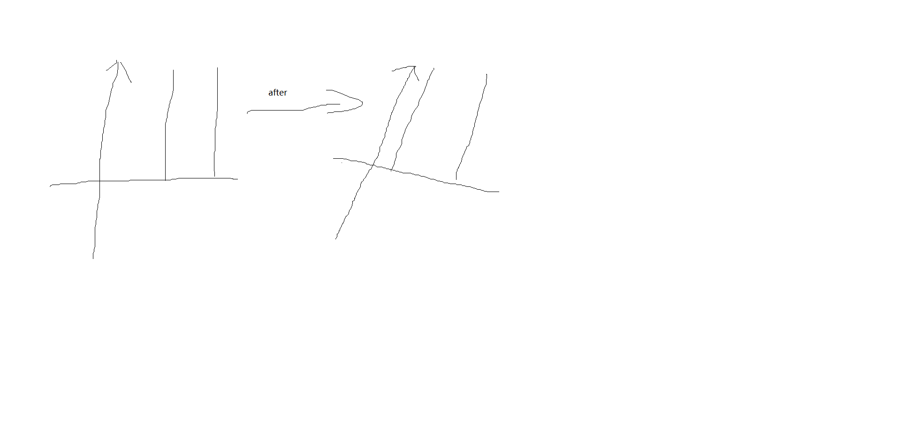

# 图像处理–特征值处理

[TOC]


## 1. SIFT（尺度不变特征变换）

### 1.1 图像灰度化

转载自：[简书](https://www.jianshu.com/p/d94e558ebe26)

```
识别物体。 最关键的因素是梯度，梯度可以看成边缘，这是最本质的部分，而计算梯度，自然就用到灰度图像了，可以把灰度理解为图像的强度。
颜色，易受光照影响，难以提供关键信息，故将图像进行灰度化，同时也可以加快特征提取的速度。
```

### 1.2 仿射不变性

```
仿射不变性是根据矩阵的乘法来。
物理意义是平面上任意两条线，经过变换后，还是保持原来的状态。（可以理解成，原来两条线是平行的，变换后还是平行的）可以看成画面的拉伸或者缩放。
```

![仿射变换]



### 1.3 局部特征

```
局部特征是某一块图像有别于整体图像的其他地方。局部特征通常是描述一块区域，使其可以具有很高的可区分度。局部特征的好坏决定着图像的分类、识别。
局部特征应该具有的特点：可重复性、可区分性、准确性、有效性（特征的数量、特征的提取效率）、鲁棒性（稳定性、不变性）
```

### 1.4 尺度不变特征变换

```
可以在不同的尺度空间上查找关键点(特征点)，并计算出关键点的方向。SIFT所查找到的关键点是一些十分突出、不会因为光照、仿射变换和噪音（这个对我很重要，因为在加密过程中，噪声是一个不可以避免的问题）等因素而变化的点。如角点、边缘点、暗区的亮点和亮区的暗点等。
```

### 1.5  SIFT特征提取方法

#### 1.5.1 构建DOG尺度空间

```
模拟图像数据的多尺度特征，大尺度抓住概貌特征，小尺度注重细节特征。通过构建高斯金字塔（每一层用不同的参数做高斯模糊（加权）），保证图像在任何尺度都能由对应的特征点，即保证尺度不变性。
```

#### 1.5.2 关键点搜索和定位

```
确定是否为关键点，需要将该店与同尺度空间不同参数值的图像中的相邻点比较，如果该点为max或min，则为一个特征点。找到所有特征点后，要去除低对比度和不稳定的边缘效应的点，留下具有代表性的关键点（比如，正方形旋转后变成为菱形，如果用边缘做识别，4条边就完全不一样，就会错误；如果用角点识别则会相对稳定一些）。去除这些点的好处是增强匹配的抗噪能力和稳定性。最后，对离散的点做曲线拟合，得到精确的关键点的位置和尺度信息。
```


#### 1.5.3 方向赋值

```
为了实现旋转不变性，需要根据检测到的关键点的局部图像结构为特征点赋值。
具体做法是用帝都方向直方图。在计算直方图时，每个加入直方图的采样点都是用图形高斯函数进行加权处理，也就是进行高斯平滑。这主要是因为SIFT算法只考虑了尺度和旋转不变形，没有考虑到仿射不变性。通过高斯平滑，可以使关键点附近的梯度幅值由较大的权重，从而部分弥补没考虑仿射不变形产生的特征点不稳定。
需要注意的是，一个关键点可能具有多个关键方向，这有利于增强图像匹配的鲁棒性。
```


#### 1.5.4 关键点描述子的生成

```
关键点描述子不但包含关键点，还包含关键点周围对其有贡献的像素点。这样可以使关键点有更多的不便特性，提高目标匹配效率。在描述子采样区域时，需要考虑旋转后进行双线性插值，防止因旋转图像出现百点。同时，为了保证旋转不变性，要以特征点为中心，在附近领域内旋转一定角度，然后计算采样区域的梯度直方图，形成n维SIFT特征矢量。最后，为了去除光照变化的影响，需要对特征矢量进行归一化处理。
```

## 1.6 SIFT 优缺点

优点

1. SIFT特征是图像的局部特征，其对旋转、尺度缩放、亮度变化保持不变性，对视角变化、仿射变换、噪声也保持一定程度的稳定性；

2. 独特性（Distinctiveness）好，信息量丰富，适用于在海量特征数据库中进行快速、准确的匹配；

3. 多量性，即使少数的几个物体也可以产生大量的SIFT特征向量；

4. 高速性，**经优化的**SIFT匹配算法甚至可以达到实时的要求；

5. 可扩展性，可以很方便的与其他形式的特征向量进行联合；

6. 需要较少的经验主义知识，易于开发。

缺点

1. 实时性不高，因为要不断地要进行下采样和插值等操作；
2. 有时特征点较少（比如模糊图像）；
3. 对边缘光滑的目标无法准确提取特征（比如边缘平滑的图像，检测出的特征点过少，对圆更是无能为力）。


